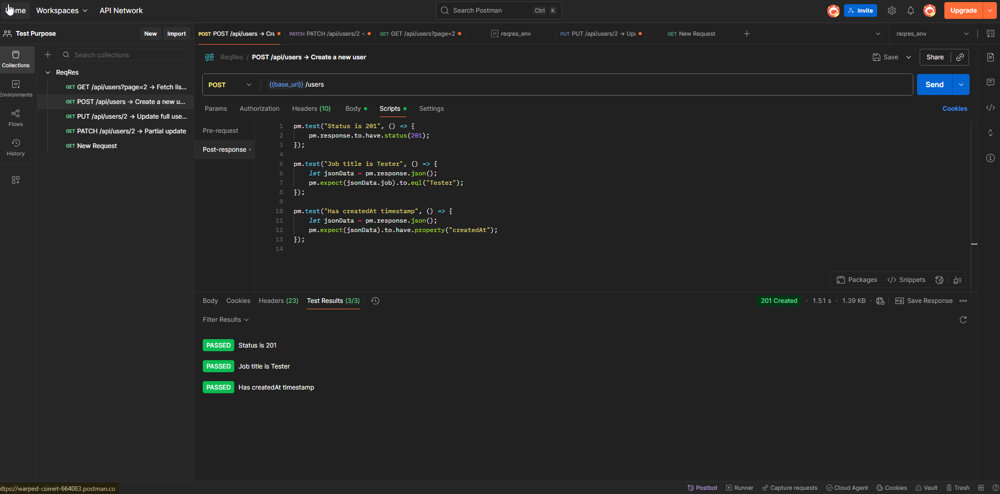
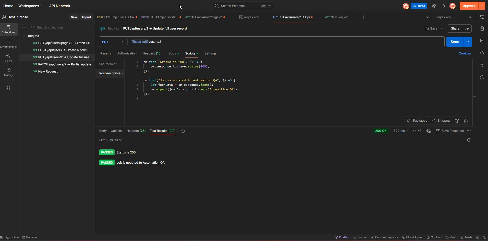
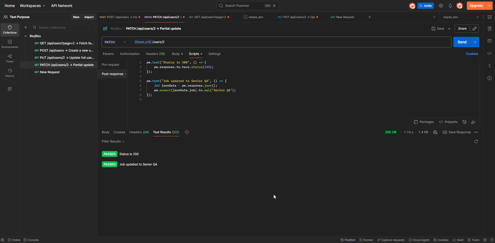

# API-Test-Automation-Postman
This project demonstrates API testing using Postman on the ReqRes.in public API. It covers basic CRUD operations (`GET`, `POST`, `PUT`, `PATCH`, `DELETE`) with test scripts to validate response codes, data structure, and performance.

## Tools Used
- Postman
- ReqRes API (https://reqres.in)
- JavaScript Test Scripts in Postman
- GitHub for version control

## 📄 How to Run
Import the collection and environment files in Postman, then run requests individually or in a collection runner.

## 📦 Postman Collection

You can import this collection into Postman to test all CRUD operations.

🔗 [Download Collection](./collection/remote-qa-reqres.postman_collection.json)

Tested Endpoints:
- GET /users?page=2
- POST /users
- PUT /users/2
- PATCH /users/2
- DELETE /users/2

## 📸 Screenshots

### ✅ POST User Test Results

### ✅ PUT User Test Results

### ✅ PATCH User Test Results

